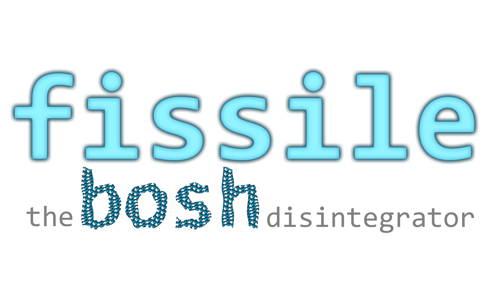

Project Tracker: https://www.pivotaltracker.com/n/projects/2192232




Fissile converts existing [BOSH] final or dev releases into docker images.

It does this using just the releases, without a BOSH deployment, CPIs, or a BOSH
agent.

[BOSH]: http://bosh.io/docs

## Getting fissile

### Prerequisites
Building fissile needs [Go 1.12] or higher and [Docker].

[Go 1.12]: https://golang.org/doc/install
[Docker]: https://www.docker.com

### Build procedure
Fissile requires generated code using additional tools, and therefore isn't
`go get`-able.

```
$ mkdir -p src                                  # make the directory src in your workspace
$ export GOPATH=$PWD                            # set GOPATH to current working directory
$ go get -d code.cloudfoundry.org/fissile       # Download sources
$ cd $GOPATH/src/code.cloudfoundry.org/fissile
$ make tools                              # install required tools; only needed first time
$ make docker-deps                        # pull docker images required to build
$ make all
```

Depending on your architecture you can use the fissile binary files from those directories:
`fissile/build/darwin-amd64` or `fissile/build/linux-amd64`.

## Using Fissile
Please refer to the following additional documentation:

* [Walkthrough] on configuring and using fissile to build a docker image and
corresponding Kubernetes resource definition
* Additional [Kubernetes] usage instructions and resource definition details
* Information on [stemcells] and how to build them
* Auto-generated [usage reference]

[walkthrough]: ./docs/configuration.md
[Kubernetes]: ./docs/kubernetes.md
[stemcells]: ./docs/stemcells.md
[usage reference]: ./docs/generated/fissile.md

## Releases using Fissile

* https://github.com/HeavyWombat/fissile-dev
* https://github.com/SUSE/SCF
* https://github.com/SUSE/nats-containerized-release
* https://github.com/SUSE/scf-helper-release
* https://github.com/SUSE/uaa-fissile-release

For testing and developing fissile itself we use the [NATS containerized release].

[NATS containerized release]: https://github.com/SUSE/nats-containerized-release

## Developing Fissile
In general, use of the default `make` target is preferred before
making a [pull request].  This will run the unit tests, as well as
various linters.  To manually build fissile only, run
`make bindata build`.  This will run the necessary code generation
before building the binary.

[pull request]: https://code.cloudfoundry.org/fissile/pulls

### Testing
Run tests with `make test` (or use `go test` directly if you want to filter for
specific tests, etc.)  There are environment variables that can be set to
adjust how tests are run:

Name | Value
--- | ---
`FISSILE_TEST_DOCKER_IMAGE` | the name of the default docker image for testing(e.g. `splatform/fissile-opensuse-stemcell:42.2`)

### Vendoring
Fissile uses [dep] for vendoring required source code.  To update the vendored
source tree, please run `dep ensure` and double-check that it has not done
anything silly.

[dep]: https://github.com/golang/dep

## Using the Example NATS Release

Requirements:
* [bosh-cli](https://github.com/cloudfoundry/bosh-cli/releases)
* Docker

First compile your version of fissile and put it into the shells `$PATH`:
```
$ cd $GOPATH/src/code.cloudfoundry.org/fissile
$ make tools build
$ cp build/linux-amd64/fissile /usr/local/bin
```

### Compiling the BOSH Releases

Clone the containerized NATS release repository: `git clone https://github.com/SUSE/nats-container-deployment`.

Inside the repository is a [containerize.sh](https://github.com/SUSE/nats-container-deployment/blob/master/containerize.sh) script. It will clone the git repositories of all involved BOSH releases and use the `bosh` CLI to create the releases. Finally the BOSH releases are build inside a Docker container.

Source the `.envrc` if you're running the commands from the script manually, it contains all the necessary configuration for Fissile.

### Building the Docker Images

Requirements:

* [minikube](https://github.com/kubernetes/minikube)

A full Kubernetes installation is not necessary to run the containerized release. [Install minikube](https://kubernetes.io/docs/tasks/tools/install-minikube/) and start it with `minikube start`.

Since the docker images need to be accessible from the Kubernetes cluster we are going to build them in minikube's Docker daemon. The [deploy.sh](https://github.com/SUSE/nats-container-deployment/blob/master/deploy.sh#L15) script does that, by setting the variables from `minikube docker-env`.

With the environment from `.envrc` loaded, `fissile build images --force` will create two docker images:

```
$ fissile show image
docker.io/bosh/fissile-nats:5546d958767e1c5a6b9f1b057ec0ffee51c556df
docker.io/bosh/fissile-secret-generation:aff03b8b7fade23c98514a52fb020ad4c1738d71
```

It's also possible to build the images locally, tag them with a public repositories address and push them there.

### Generating Helm Charts and Deploying to Kubernetes

Requirements:

* [kubectl](https://kubernetes.io/docs/tasks/tools/install-kubectl/)
* [Helm](https://github.com/helm/helm/releases)

With the Docker images built we can now generate Helm charts:

```
$ fissile build helm --auth-type rbac --defaults-file defaults.txt
```

The generated chart is missing a basic `Chart.yaml`:

```
cat > "$FISSILE_OUTPUT_DIR/Chart.yaml" << EOF
apiVersion: 1
description: A Helm chart for NATS
name: my-nats
version: 1
EOF
```

After installing the Helm CLI and running `helm init` we can deploy the NATS release:

```
$ helm install nats-chart --name my-nats --namespace my-nats --values vars.yml
```

### Removing the Example Release

Most work is done in the `output` folder. The Helm chart is generated in `nats-chart/`.
These folders can be safely removed to start from scratch.

Use `docker rmi` to remove images from docker.

To remove the Helm deployment and release run `helm delete --purge my-nats`. To be sure all k8s resources are removed run `kubectl delete namespace my-nats`.

### Acceptance Tests with Example Release

Several [manual test cases](https://github.com/cloudfoundry-incubator/fissile/wiki/Helm-Secret-Management#commands-to-use-for-testing) around secret generation exist, which we run against the example release. We're currently evaluating more test cases and [automated CI](https://gist.github.com/manno/9567bfabecdf47ca28303121006b5aa0).
